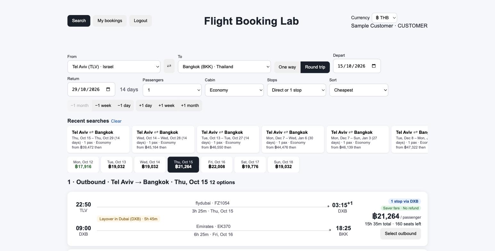
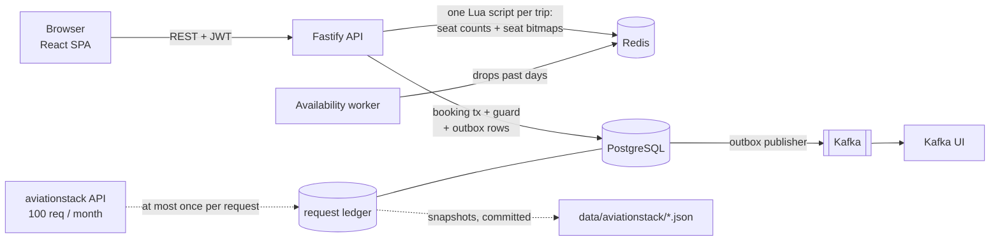
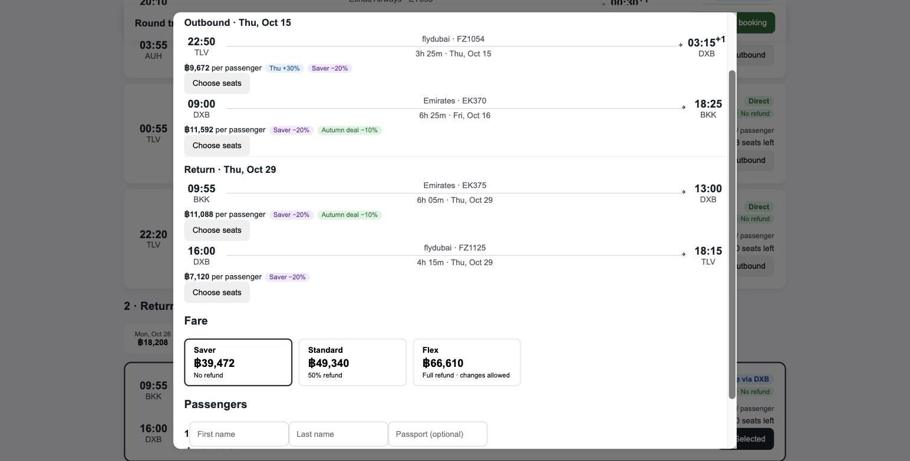
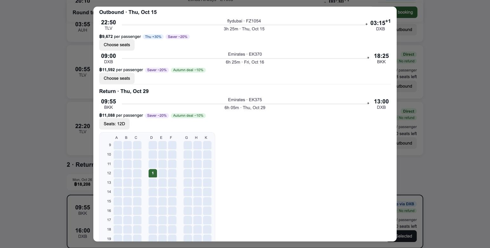
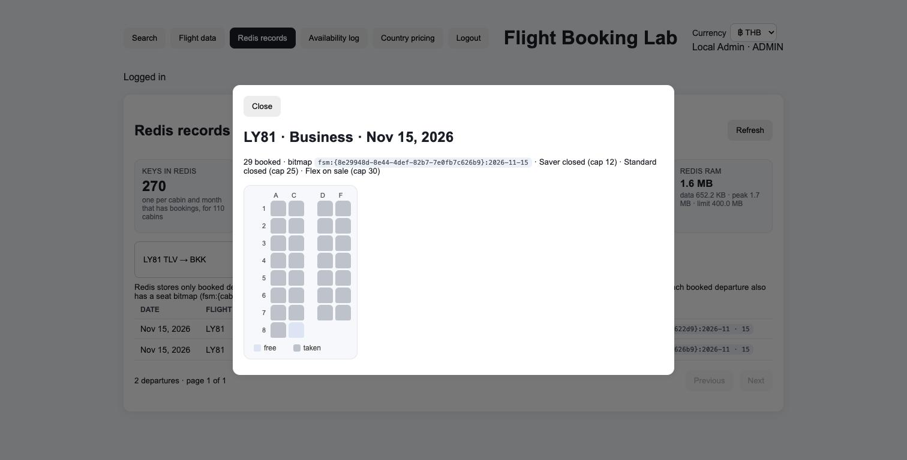
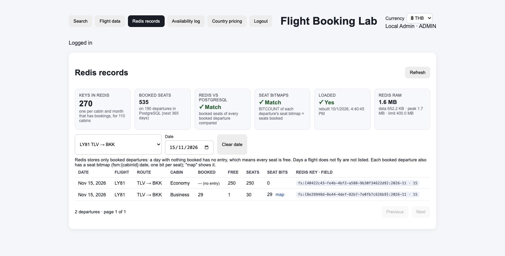
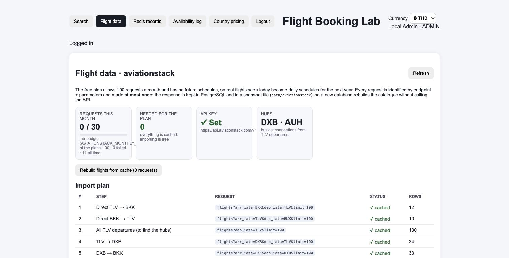
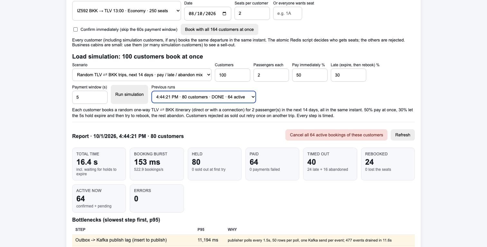

# Flight Booking Lab

[](https://github.com/allimist/flight-booking-lab/actions/workflows/ci.yml)


[](LICENSE)



A hands-on learning project that rebuilds the core of a flight booking site for one market, **Tel Aviv (TLV) ⇄ Bangkok (BKK)**, direct and with one connection through Dubai or Abu Dhabi. It keeps the hard parts: atomic seat holds over every flight of a trip under concurrency, seat maps (a Redis bitmap per departure) and nested fare classes, a payment hold with a timeout, the transactional Outbox pattern into Kafka, role-based access with admin impersonation, and a load simulator that shows where the bottlenecks are.

The flights are real: they come from the [aviationstack](https://aviationstack.com) API, whose free plan allows only **100 requests a month**. So the lab never makes the same request twice (see below).

It is the sister project of `hotel-booking-lab` and uses the same stack, patterns, code layout and shared tables, so the two can later be merged into one travel lab.

Everything runs locally with Docker Compose or Podman Compose. Nothing is production-ready on purpose: passwords are plain text and shown on the login page so anyone can try every role.

## Architecture



- **Redis decides fast**: one atomic Lua script per booking checks every flight of the trip (seats left under the fare class cap, the chosen seats free), then takes them all or nothing.
- **PostgreSQL decides last**: the booking transaction locks the cabins, re-counts the passengers, and a partial unique index refuses a seat that is already taken. If Redis is ever wrong, the booking is rejected, never overbooked.
- **Kafka never blocks a booking**: events are written to an outbox table in the same transaction and published afterwards. The API takes bookings even while Kafka is down.

## Measured

80 customers booking at the same instant, 2 passengers each, one-way TLV ⇄ BKK trips (often 2 flights), on a laptop with Podman:

| Step | p50 | p95 |
|---|---|---|
| Redis Lua hold, all flights of the trip (counts + seat bits) | 1.1 ms | 3 ms |
| PostgreSQL booking transaction (guard, legs, seats, outbox rows) | 81 ms | 97 ms |
| Booking request end to end | 120 ms | 149 ms |
| Payment-timeout worker delay after expiry | | 1.6 s |
| Outbox → Kafka publish lag | | 11.2 s |

Seat races: 84 customers wanting seat 4A at the same instant gave exactly 1 winner. 164 customers booking 2 seats each in a 30-seat business cabin gave 14 winners (28 seats) and 150 rejections, with no overbooking. After every run the Redis counts, the seat bitmaps and PostgreSQL match. The bottleneck is the outbox publisher (1.5 s polling, one Kafka send per event), as in the hotel lab.

## Stack

| Layer | Choice | Why it is here |
|---|---|---|
| API | Node.js 22, TypeScript, Fastify 5 | small, fast, typed REST API |
| Web | React 19, Vite 8, TypeScript | single-file SPA, inline SVG charts |
| Source of truth | PostgreSQL 16 | users, airports, airlines, flights, cabins, bookings, aviationstack request ledger, audit log, outbox |
| Seats / holds | Redis 7 + Lua | booked seats per departure and a seat bitmap per departure; one atomic all-or-nothing hold over every leg of a trip; capped with `maxmemory` |
| Availability worker | Node.js 22, TypeScript | removes past departure days from Redis once a day |
| Events | Apache Kafka 3.9 (KRaft) + Kafka UI | domain events published from the outbox |
| Flight data | aviationstack `/v1/flights` | real flights, cached forever (ledger + committed snapshots) |
| Auth | JWT | roles CUSTOMER / SELLER (airline) / ADMIN, admin impersonation with audit trail |
| CI | GitHub Actions | typecheck + build of every app, and an end-to-end smoke test on the full compose stack with no aviationstack key |

## Screens

| | |
|---|---|
|  |  |
| **Booking**: one fare class for the whole trip (Saver / Standard / Flex), with each flight's price layers | **Seat picker**: choose a seat per passenger and flight, or let the hold assign the first free ones |
|  |  |
| **Seat bitmap** (admin): 29 of 30 seats taken; Saver and Standard closed, only Flex left | **Redis records**: Redis counts and seat bitmaps checked against PostgreSQL |
|  |  |
| **Flight data**: 0 requests needed, everything served from the ledger and snapshots | **Load simulation**: 80 customers at once, with outcomes and bottlenecks |

| Customer | Seller (airline) | Admin |
|---|---|---|
| Search with fare date strips (outbound and return), recent searches, USD / NIS / THB, fare classes, seat selection, My bookings with payment countdown and refunds | Dashboard (seats and load factor), My flights with passengers' seats, fare rules and 60-day fare calendar | Flight data (aviationstack budget and ledger), Redis records with seat maps, concurrency demo (incl. same-seat race), load simulation, country pricing and display currencies |

## Run it

```bash
cp .env.example .env        # optional: put your aviationstack key in it
podman compose up --build   # or: docker compose up --build
```

Without a key the lab still has real flights: the responses of every request made so far are committed in `data/aviationstack/`, and the import reads those first.

| What | Where |
|---|---|
| Web app | http://localhost:5174 |
| API | http://localhost:3020/api/health |
| Kafka UI | http://localhost:8081 |
| PostgreSQL | `localhost:5435`, user / password / db `booking` |
| Redis | `redis://localhost:6380` |

Ports are offset from the hotel lab (5173, 3010, 8080, 5433, 6379) so both can run at the same time. Kafka is not published on the host.

First steps: log in as admin (`admin@example.com` / `admin123`), open **Flight data** and press **Import** (free when everything is cached), then **Search → Generate Sample Data**. That creates two airline sellers (`seller@example.com`, `seller2@example.com`) and two customers (`customer@example.com`, `customer2@example.com`); every password is on the login page.

After changing code:

```bash
podman compose up --build -d --force-recreate --no-deps api availability-worker web
```

## aviationstack: 100 requests a month, never the same one twice

The free plan has real-time flights but no future schedules. So every operating flight seen today (codeshares folded into the operating flight) becomes a **daily schedule for the next 365 days**, with synthetic cabins: economy and business seats by aircraft type or flight length, base fares in baht from the flight time.

| Safeguard | How |
|---|---|
| Request ledger | `api_requests.request_key` is UNIQUE: endpoint + sorted parameters, never the key. A request that exists is answered from PostgreSQL. |
| Claim before calling | the row is inserted as `PENDING` in the same transaction as the budget check, under an advisory lock, *before* the HTTP call. Two concurrent identical requests cannot both go out. |
| Monthly budget | `AVIATIONSTACK_MONTHLY_BUDGET` (default 30 of the plan's 100). Every real HTTP call is a row in `api_calls`; above the budget nothing is called. |
| Snapshots | every successful response is also written to `data/aviationstack/<hash>.json` and committed. A new database, `compose down -v` or a fresh clone costs 0 requests. |
| No automatic retries | a failed or interrupted request stays `FAILED`; only the admin's **Retry** spends another call on it. The import stops at the first failed call. |
| Plan before spending | **Flight data** shows every planned request, which are cached, and how many would really be made; the admin confirms. |

The import plan is 11 requests: TLV→BKK and BKK→TLV direct, all TLV departures (to find the two busiest hubs with service to Bangkok), then TLV→hub, hub→BKK, BKK→hub and hub→TLV for each hub. The first run found **DXB and AUH** and built 55 real flights (El Al, flydubai, Emirates, Etihad, and others).

The key lives only in `.env` (gitignored) and in the API container's environment. It is never stored, logged or sent to the browser; error messages are redacted.

## What you can do

**As a customer**
- Search one way or round trip, direct or with one stop, by cabin and passenger count. The form shows the trip length ("14 days"), and shift buttons move the whole trip by a day, week or month.
- Two date strips show the cheapest fare per day for the 7 days around the departure and around the return. Click a day to move just that flight; return days before the departure are disabled.
- Each result shows every flight, the layover (airport and length), a Direct / 1 stop badge, seats left, and the price per passenger. Hovering the price shows its layers.
- Pick an outbound and a return, then a **fare class** for the whole trip:

  | Fare | On sale while the cabin is below | Price | If you cancel |
  |---|---|---|---|
  | Saver | 40% sold | −20% | no refund |
  | Standard | 85% sold | base | 50% back |
  | Flex | 100% (to the last seat) | +35% | 100% back, changes allowed |

  Cheap seats run out first, as with real airlines: search shows the cheapest class still on sale and how many seats are left at it.
- **Choose seats** on a seat map for every flight (business 2-2, economy 3-3 or 3-3-3, rows numbered on after business), or skip it and get the first free seats.
- Book: seats on **every flight of the trip** are held at once (all or nothing, chosen seats included) and the booking is *Awaiting payment*. Pay within 60 seconds in **My bookings** or the status becomes *Payment timed out* and the seats go back.
- **Recent searches**: your last 10 searches (route, dates, passengers, cabin, stops, and the cheapest fare at the time) sit under the search form; click one to run it again. Stored per account in Redis, so they follow you to another browser. A search is recorded once its results have stayed on screen for 2 seconds, and a repeated search moves to the top instead of appearing twice.
- Show prices in **baht, US dollars or shekels** (selector in the header, remembered per browser). Prices are always computed and charged in baht; other currencies are converted in the browser with fixed rates the admin sets under **Country pricing → Display currencies**, so no exchange-rate API is called.
- My bookings shows each passenger's seat on each flight, the fare class, a live countdown, Pay and Cancel buttons (with the refund the fare class gives), the trip phase (Upcoming / Travelling / Completed), and a warning when two trips overlap in time.

**As a seller (an airline)**
- **Dashboard**: seats booked vs free per day across your departures, and load factor, bookings and revenue per flight, for the next 7 / 14 / 30 days.
- **My flights**: your airlines' flights with cabins, seats, fares and the bookings on each.
- **Prices**: per airline, the base fare of every cabin, your own day-of-week %, and seasons, holidays and discounts for the whole airline, one flight or one cabin. A 60-day fare calendar shows every cabin's price with its layers.

**As an admin**
- **Flight data**: the aviationstack budget, import plan, request ledger and call log.
- Generate / delete sample data, create sample trips for a customer, rebuild the Redis seat cache from PostgreSQL.
- **Redis records**: every departure with the booked seats Redis holds and the bits set in its seat bitmap, plus two checks against PostgreSQL (counts, and BITCOUNT = seats booked). Click **map** to see a departure's bitmap as a seat map. Also **Availability log** and **Country pricing**.
- **Concurrency demo**: every customer books N seats on the same departure at the same instant, or everyone wants **one seat** (e.g. 1A); see exactly who wins.
- **Load simulation**:
  - *Random trips*: N customers book random TLV ⇄ BKK itineraries in the next 14 days; some pay, some let the hold expire and rebook, the rest abandon.
  - *Same flight*: everyone wants one departure. Rejected customers try other options on the same route that day, then the next day.

## How the booking flow works

1. `POST /api/flight-bookings` validates the trip:
   - legs connect (airport and 90 min – 12 h layover);
   - the return goes back from the destination to the origin;
   - the first departure is at least 2 hours away.
2. The trip is priced in the chosen fare class, then **one Lua script** checks every leg:
   - Redis stores how many seats are booked per cabin and departure day (`fs:{cabinId}:YYYY-MM`). Capacity comes from PostgreSQL, and the fare class turns it into a cap (Saver 40%, Standard 85%, Flex 100%).
   - Each departure also has a seat bitmap (`fsm:{cabinId}:YYYY-MM-DD`, bit = seat).
   - The script fails, changing nothing, if any leg has too few seats under the cap or a chosen seat is taken.
   - Otherwise it gives passengers without a choice the first free seats, adds the passengers to every leg's count and sets every seat bit, atomically.
3. Inside the booking transaction PostgreSQL has the last word:
   - it locks the cabins (in id order, so trips sharing flights cannot deadlock);
   - it sums the active passengers per departure against the cap;
   - a partial unique index on the seat assignments refuses a seat that is already taken;
   - if Redis was ever wrong, the booking is rejected instead of overbooked.
4. The booking is inserted as `PENDING` with `expires_at = now() + 60s`, together with its legs, passengers, seat assignments, and `flight.booking.created` plus `flight.seats.changed` outbox rows, all in the same transaction.
5. `POST /api/flight-bookings/:id/pay` is a single conditional `UPDATE ... WHERE status='PENDING' AND expires_at > now()`.
6. A worker moves expired holds to `PAYMENT_TIMEOUT` (`FOR UPDATE SKIP LOCKED`) and gives every leg's seats back to Redis, counts and seat bits both. Cancelling does the same and refunds the fare class's share of a paid booking.
7. The outbox publisher sends events to Kafka. Topics:
   - `flight.booking.created`, `flight.booking.confirmed`, `flight.booking.payment_timeout`, `flight.booking.cancelled`
   - `flight.seats.changed`, `flight.data.imported`
8. Redis is treated as a cache. At startup, and from the admin panel, the booked counts and seat bitmaps are rebuilt from PostgreSQL. Until that has run once (key `fs:loaded`), bookings are refused rather than treating an empty Redis as "all free".

More detail in [ARCHITECTURE.md](ARCHITECTURE.md).

## API overview

| Method | Path | Role |
|---|---|---|
| GET | `/api/auth/demo-accounts`, `/api/stats`, `/api/airports`, `/api/currencies` | public |
| PUT | `/api/admin/currencies/:code` `{ thbPerUnit }` | admin, display rate (THB is the base) |
| POST | `/api/auth/login` | public |
| GET | `/api/flights/search?from=&to=&date=&passengers=&cabin=&stops=&sort=` | public (sellers see only their airlines) |
| GET | `/api/flights/calendar?from=&to=&date=&days=7` | public, cheapest fare per day |
| GET | `/api/flights/:scheduleId?date=` | public, cabins with seats left and prices |
| GET | `/api/flights/seatmap?cabinId=&date=` | public, layout, taken seats and fare class caps |
| GET | `/api/fare-classes` | public |
| POST | `/api/flight-bookings` `{ fareClass?, legs: [{cabinId, date, direction, seats?: ["23A"]}], passengers: [{firstName, lastName, passport?}] }` | customer, holds every leg |
| POST | `/api/flight-bookings/:id/pay`, `/api/flight-bookings/:id/cancel` | customer |
| GET | `/api/flight-bookings/me` | customer |
| GET / POST / DELETE | `/api/me/search-history` | any logged-in user, last 10 searches |
| GET | `/api/seller/dashboard?days=7`, `/api/seller/flights`, `/api/seller/flights/:id/bookings` | seller |
| GET | `/api/seller/airlines/:iata/prices?days=60` | seller |
| PATCH | `/api/seller/cabins/:id` `{ price }` | seller |
| PUT | `/api/seller/airlines/:iata/weekdays` `{ pct }` | seller |
| POST / DELETE | `/api/seller/airlines/:iata/price-rules`, `/api/seller/price-rules/:id` | seller |
| GET / PUT / POST / DELETE | `/api/admin/country-pricing…`, `/api/admin/price-rules/:id` | admin |
| GET | `/api/admin/aviationstack` | admin, budget + plan + ledger |
| POST | `/api/admin/aviationstack/import` `{ confirm: true }`, `/api/admin/aviationstack/retry` `{ key }` | admin |
| GET / POST | `/api/admin/users`, `/api/admin/flights`, `/api/admin/impersonate/:userId` | admin |
| POST / DELETE | `/api/admin/sample-data`, `POST /api/admin/sample-bookings` `{ userId }` | admin |
| POST | `/api/admin/concurrent-booking` `{ cabinId, date, passengers, seat?, confirm? }` | admin |
| POST | `/api/admin/simulation` `{ mode: random/same-flight, customers, passengers, payRatio, lateRatio, windowSeconds, cabinId?, date? }` | admin, then `GET /api/admin/simulation/:id`, `POST .../cancel-all` |
| POST | `/api/admin/rebuild-availability`; GET `/api/admin/redis-records`, `/api/admin/availability-log` | admin |

## Tests and CI

`scripts/smoke.sh` is an end-to-end test against a running stack. It:
1. imports flights from the committed snapshots and fails on any real aviationstack call;
2. books a chosen seat at the Saver fare and pays;
3. checks that the same seat cannot be sold twice;
4. checks that Flex refunds 100%;
5. checks that Redis (counts and seat bitmaps) agrees with PostgreSQL.

```bash
podman compose up -d --build && ./scripts/smoke.sh
```

GitHub Actions runs it on every push, after typechecking and building the API, the worker and the web app.

## Project layout

```
apps/api/src/server.ts                   Fastify API, aviationstack client, workers, simulation (single file on purpose)
apps/availability-worker/src/worker.ts   daily cleanup of past departure days in Redis
apps/web/src/main.tsx                    React SPA
apps/web/src/style.css
database/init.sql                        schema for a fresh database
data/aviationstack/                      cached aviationstack responses (committed; no key inside)
scripts/smoke.sh                         end-to-end smoke test (also run by CI)
.github/workflows/ci.yml                 typecheck + build + smoke test
docs/                                    screenshots
docker-compose.yml, .env.example
```

## Not production-ready, by design

Plain-text passwords, no rate limiting, a smoke test rather than a full test suite, one API instance, in-process workers, no real payment. Schedules are "today's flights, every day", and cabins, seat layouts and fares are synthetic.
